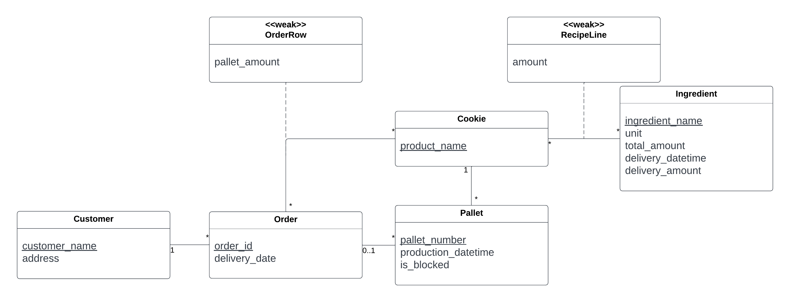

# EDAF75, project report

This is the report for

 + Kristian Ahrendtsen Blom, `kr8753bl-s`
 + Oscar Cederberg, `os7138ce-s`
 + Carina Persson `ca6257pe-s`

We solved this project on our own, except for:

 + The Peer-review meeting

## ER-design

The model is in the file [`er-model.png`](er-model.png):

<center>
    
</center>

## Tables

The ER-model above gives the following tables (including keys and
foreign keys):

```text

table cookies:
  product_name
  PK: product_name

table ingredients:
  ingredient_name
  unit
  total_amount
  delivery_datetime
  delivery_amount
  PK: ingredient_name

table recipe_lines:
  product_name
  ingredient_name
  amount
  PK: product_name, ingredient_name
  FK: product_name -> cookies(product_name)
  FK: ingredient_name -> ingredients(ingredient_name)

table customers:
  customer_name
  address
  PK: customer_name

table orders:
  order_id
  customer_name
  delivery_date
  PK: order_id
  FK: customer_name -> customers(customer_name)

table order_rows:
  order_id
  product_name
  amount
  PK: order_id, product_name
  FK: product_name -> cookies(product_name)
  FK: order_id -> orders(order_id)

table pallets:
  pallet_number
  product_name
  order_id
  production_datetime
  is_blocked
  PK: pallet_number
  FK: product_name -> cookies(product_name)
  FK: order_id -> orders(order_id)

```

## Scripts to set up database

The scripts used to set up and populate the database are in:

 + [`krusty-schema.sql`](src/krusty-schema.sql) (defines the tables), and

So, to create and initialize the database, we run:

```shell
sqlite3 krusty-db.sqlite < krusty-schema.sql
```

## How to compile and run the program

```shell
python krusty.py
```
